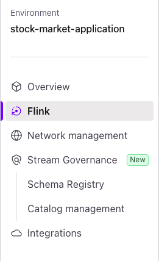
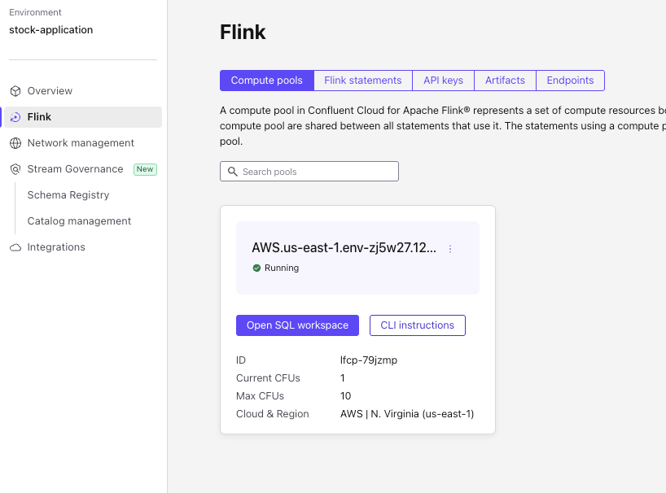
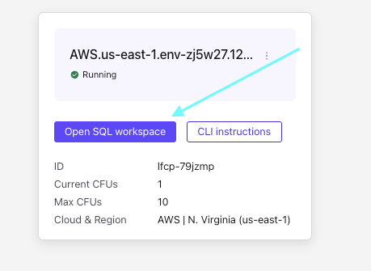

# Real-Time Stock Market Dashboard

A real-time stock market monitoring application built with FastAPI backend and Streamlit frontend, featuring live price updates through Kafka integration.

## 🚀 Features

- Real-time stock price monitoring
- Interactive buy/sell interface
- Historical price visualization
- Live price updates via Kafka
- RESTful API endpoints for stock data
- Streamlit-based responsive dashboard

## 🛠 Tech Stack

- **Backend**: FastAPI
- **Frontend**: Streamlit
- **Message Broker**: Confluent Kafka
- **Stream Processing**: Confluent Flink
- **Database**: SQLAlchemy with SQLite
- **Data Visualization**: Plotly

## 📋 Prerequisites

- Python 3.8+
- pip (Python package manager)
- A Confluent Cloud account. 
[Sign up](https://www.confluent.io/confluent-cloud/tryfree) for a free trial if you don't already have one.
* The Confluent CLI. 
Refer to the installation instructions [here](https://docs.confluent.io/confluent-cli/current/install.html).


## Setting up Confluent Cloud Components

1. **Login to your confluent cloud account by running the following in your terminal**
```shell
  confluent plugin install confluent-cloud_kickstart
```

  This plugin allows you to provision a Confluent Cloud environment, cluster, and API key in one command. 
  It also enables Schema Registry. 
  You may pick `aws`, `azure`, or `gcp` as the `--cloud` argument, and any supported region returned by `confluent kafka region list` as the `--region` argument. 
  For example, to use AWS region `us-east-2`:

```shell
  confluent cloud-kickstart --name stock-app \
    --env stock-market-application \
    --cloud aws \
    --region us-east-2 \
    --output-format stdout
```
The output of this command will contain Kafka and Schema Registry API connection properties that we will use in the next section. Please make sure you copy and keep in your notes.


2. **Now, create a Flink compute pool in the Confluent Cloud Console by navigating to the [Environments page](https://confluent.cloud/environments), selecting the `stock-market-application` environment, and then clicking the `Flink` tab in the left sidebar:**

  

  Click the `Create compute pool` button, use provider as `aws` and region as `us-east-2` that you used earlier in the 
  `confluent cloud-kickstart` command, and then click `Create`.

  You will see the compute pool tile showing that the pool is `Provisioning`:

  

  Once the Flink compute pool status changes to `Running` (note: you may need to refresh the page), click the `Open SQL workspace` button:

  

  Copy these commands into the SQL workspace, one at a time, and click `Run`. 

```sql
-- Create source table for stock prices
  CREATE TABLE orders (
      order_id INT,
      stock_id INT,
      order_type STRING,
      price DOUBLE,
      quantity BIGINT,
      created_at STRING,
      ts AS TO_TIMESTAMP(created_at, 'yyyy-mm-dd hh:mm:ss'),
      WATERMARK FOR ts AS ts - INTERVAL '1' SECOND
  ) WITH (
    'value.format'='json-registry'
  );
```

```sql
  -- Create sink table for processed data
  CREATE TABLE stock_prices (
    stock_id INT,
    price DOUBLE,
    ts TIMESTAMP(3)
  ) WITH (
    'changelog.mode'='append',
    'value.format'='json-registry'
  );
```
```sql
  -- Add your custom Flink SQL statements below:
  INSERT INTO `stock_prices`
  SELECT
    stock_id,
    CASE
      WHEN SUM(CASE WHEN order_type = 'BUY' THEN 1 ELSE 0 END)
        > SUM(CASE WHEN order_type = 'SELL' THEN 1 ELSE 0 END)
        THEN AVG(price) * 1.10

      WHEN SUM(CASE WHEN order_type = 'SELL' THEN 1 ELSE 0 END)
        > SUM(CASE WHEN order_type = 'BUY' THEN 1 ELSE 0 END)
        THEN AVG(price) * 0.90

      ELSE AVG(price)
    END AS adjusted_price,
    window_end AS ts
  FROM TABLE(
    TUMBLE(
      TABLE orders,
      DESCRIPTOR(ts),
      INTERVAL '1' SECONDS
    )
  )
  GROUP BY
    stock_id,
    window_start,
    window_end;
```

## 🔧 Installation & Setup

1. **Clone the repository**
    ```bash
      git clone https://github.com/kos-conf/stock-market-application.git
    ```
2. **Enter inside the working directory**  
    ```bash
    cd stock-market-application
    ```
3. **Create a new virtual environment**
    ```bash
    python -m venv venv
    ```
4. **Activate the virtual environment**
    ```bash
    source venv/bin/activate # For Mac Users
    ```
    ```shell
    .\Scripts\bin\activate.bat # For Windows Users
    ```
5. **Install dependencies**
    ```bash
    pip install -r requirements.txt
    ```

6. **Set up environment variables by creating a `.env` file in the root directory:**
    ```env
    # Database
    DATABASE_URL=sqlite:///./stock_market.db

    # Kafka
    KAFKA_BOOTSTRAP_SERVERS=pkc-xxxxx.xxxxxx.xxx.confluent.cloud:9092   # Paste Bootstrap server endpoint
    KAFKA_ORDERS_TOPIC=orders
    KAFKA_STOCK_PRICE_TOPIC=stock_prices
    KAFKA_CONSUMER_GROUP=order_processor_group
    KAFKA_API_KEY=xxxxxx                    # Paste Kafka API Key
    KAFKA_API_SECRET=xxxxxxxx               # Paste Kafka API Key Secret
    ```


## 🚀 Running the Application

1. **Start the FastAPI backend from the parent folder of the application**
    ```bash
    uvicorn app.fastapi_app.main:app --reload --port 8001
    ```

2. **Wait until the backend starts and you see the follwing in your terminal**
    ```shell
    (venv) venv➜  stock-market-application git:(main) ✗ uvicorn app.fastapi_app.main:app --reload --port 8001
    INFO:     Will watch for changes in these directories: ['/Users/koushiks/Dev/projects/stock-market-application']
    INFO:     Uvicorn running on http://127.0.0.1:8001 (Press CTRL+C to quit)
    INFO:     Started reloader process [13040] using WatchFiles
    /Users/koushiks/Dev/projects/stock-market-application/venv/lib/python3.13/site-packages/pydantic/_internal/_config.py:373: UserWarning: Valid config keys have changed in V2:
    * 'orm_mode' has been renamed to 'from_attributes'
      warnings.warn(message, UserWarning)
    INFO:     Started server process [13042]
    INFO:     Waiting for application startup.
    2025-05-14 16:23:20 | INFO     | app.fastapi_app.main:start_stock_price_consumer:27 - Initializing database tables...
    2025-05-14 16:23:20 | INFO     | app.fastapi_app.db.database:init_db:16 - Running init_db(). DB URL: sqlite:///./stock_market.db
    2025-05-14 16:23:20 | INFO     | app.fastapi_app.db.database:init_db:19 - Expected SQLite DB file path: /Users/koushiks/Dev/projects/stock-market-application/stock_market.db
    2025-05-14 16:23:20 | INFO     | app.fastapi_app.main:start_stock_price_consumer:30 - Starting Kafka stock price consumer background thread...
    2025-05-14 16:23:20 | INFO     | app.fastapi_app.main:start_stock_price_consumer:33 - Stock Market Application started successfully.
    2025-05-14 16:23:20 | INFO     | app.fastapi_app.services.kafka_service:consume_stock_price_updates:50 - Consuming stock price updates from topic: stock_prices
    INFO:     Application startup complete.
    ```

2. **Open a new terminal and create a new stock by running the following in your terminal**
    ```bash
      curl -X 'POST' \
      'http://localhost:8001/stocks/stocks' \
      -H 'accept: application/json' \
      -H 'Content-Type: application/json' \
      -d '{
        "symbol": "AAPL",
        "name": "Apple US Inc",
        "price": 144
      }'
    ```
    Output would be:
    ```bash
      {"symbol":"AAPL","name":"Apple US Inc","price":144.0,"id":1}
    ```

3. **Start the Streamlit frontend in the new terminal by activating the virtual environment**
   ```bash
   source venv/bin/activate
   ```
   ```bash
   streamlit run app/streamlit_app/main.py
   ```

5. **Access the application**
   - Frontend Dashboard: http://localhost:8501

6. **Start simulating the buy operation by clicking buy button 5 to 6 times in interval of 1 seconds each**

7. **You will notice the update in stock price by 10% and the graph will go up**

8. **Simulate stock buy/sell operations by clicking buy and sell buttons randomly for 10 seconds with 1 second interval each**

## Troubleshooting

1. If you do not see the graph changing, check for data in `stock_prices` topic. Until you have data in `stock_prices` topic you can't see the graph being updated.
2. Avoid running `confluent cloud-kickstart` command multiple times, this will lead to creation of multiple environments. If you're encounter an error with either API keys limit reached or other, just try to delete the existing created environment and retry the command

## Tear down infrastructure

Once you are done exploring, don't forget to tear down the Confluent Cloud resources created for this demo.

**First stop all the Flink statements in SQL Workspace before we execute the next steps (!Important)**

On the Confluent Cloud side, since you created all resources in an environment, you can simply delete the environment and then all resources created for this demo will be deleted (i.e., the Kafka cluster, connector, Flink compute pool, and associated API keys). 

```shell
confluent environment list
```

Now delete the environment:

```shell
confluent environment delete <ENVIRONMENT_ID>
```

